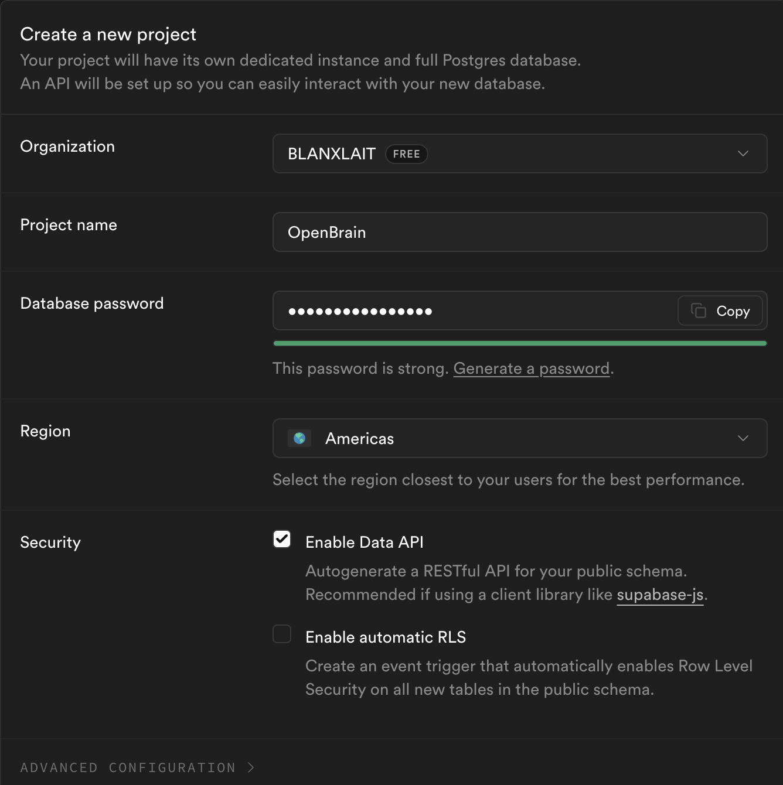
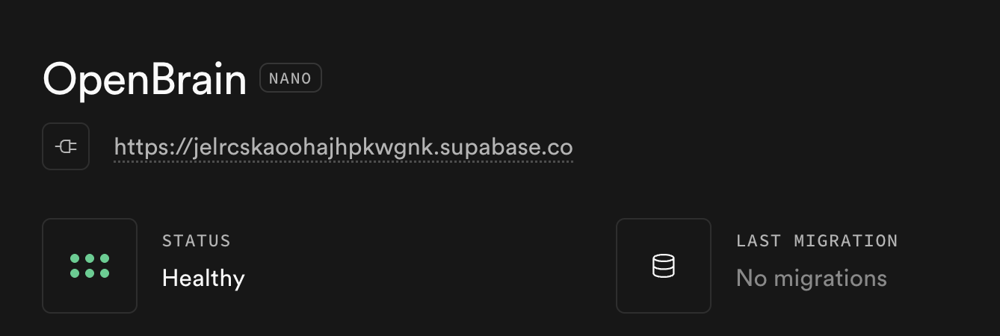

# Open Brain

One database that every AI you use shares as persistent memory. Claude, ChatGPT, Gemini, Cursor — one brain, all of them.

```
Claude Code ──┐
Claude Desktop ┼── MCP ──→ Edge Function ──→ Supabase (pgvector)
ChatGPT ───────┤                                    ↕
Gemini CLI ────┘                             OpenRouter (embed + classify)
```

## What You Get

- **Semantic search** — Find thoughts by meaning ("career changes" matches "Sarah is leaving her job")
- **Capture from anywhere** — Any connected AI can save thoughts directly
- **Memory migration** — Pull memories out of ChatGPT, Claude, and Gemini into one shared brain
- **Skills for each AI** — Pre-built instructions that teach each client how to use the brain

## The Demo

1. Connect your AIs to the brain
2. Migrate your ChatGPT memories into it
3. Open Claude and ask about something you just migrated
4. It works. One brain, every AI.

## Cost

| Service | Cost |
|---------|------|
| Supabase (free tier) | $0 |
| OpenRouter (embeddings + classification) | ~$0.10–0.30/month |

Two accounts. That's it.

---

## Setup (15 minutes)

### 1. Create Accounts

- **[Supabase](https://supabase.com)** — Sign up, create a new project, note the **Project Ref** from the dashboard URL
- **[OpenRouter](https://openrouter.ai)** — Sign up, create an API key, add $5 in credits (lasts months)






### 2. Install Prerequisites

You need a package manager to install the Supabase CLI. If you already have one, skip to the CLI install.

**Mac — Install Homebrew** (if you don't have it):
```bash
/bin/bash -c "$(curl -fsSL https://raw.githubusercontent.com/Homebrew/install/HEAD/install.sh)"
```
After it finishes, follow the instructions it prints to add Homebrew to your PATH. Then close and reopen Terminal.

**Windows — Install Scoop** (if you don't have it):
```powershell
Set-ExecutionPolicy -ExecutionPolicy RemoteSigned -Scope CurrentUser
Invoke-RestMethod -Uri https://get.scoop.sh | Invoke-Expression
```

Now install the Supabase CLI:

```bash
# Mac
brew install supabase/tap/supabase

# Windows
scoop bucket add supabase https://github.com/supabase/scoop-bucket.git
scoop install supabase

# Linux
npm install -g supabase
```

Verify it works:
```bash
supabase --version
```

### 3. Clone and Run Setup

```bash
git clone https://github.com/blanxlait/openbrain.git
cd openbrain
chmod +x setup.sh
./setup.sh
```

The script prompts for your Supabase Project Ref and OpenRouter API key, then:
- Links to your Supabase project
- Creates the database (table, vector search, security policies)
- Deploys the MCP server Edge Function
- Generates an MCP access key
- Prints everything you need to connect

### 4. Connect Your AIs

The setup script prints your MCP Connection URL and access key. Use them below.

#### Claude Desktop

1. Settings → Connectors → **Add custom connector**
2. Name: `Open Brain`
3. URL: paste your MCP Connection URL (the one with `?key=...`)
4. Add the skill: copy `skills/claude-desktop.md` into Project Instructions

#### Claude Code

```bash
claude mcp add --transport http open-brain \
  https://YOUR_PROJECT_REF.supabase.co/functions/v1/open-brain-mcp \
  --header "x-brain-key: YOUR_MCP_ACCESS_KEY"
```

> The skill loads automatically from the `CLAUDE.md` in this repo when you run Claude Code from the `openbrain/` directory.

#### ChatGPT (paid plans)

1. Settings → Apps & Connectors → Advanced settings → **Developer Mode ON**
2. Settings → Apps & Connectors → **Create**
3. Name: `Open Brain`, URL: paste your MCP Connection URL, Auth: None
4. Copy `skills/chatgpt-instructions.md` into Custom Instructions or create a Custom GPT

> Note: Developer Mode disables ChatGPT's built-in Memory. Your Open Brain replaces it — and works across every AI.

#### Gemini CLI

```bash
gemini mcp add -t http open-brain \
  https://YOUR_PROJECT_REF.supabase.co/functions/v1/open-brain-mcp \
  -H "x-brain-key: YOUR_MCP_ACCESS_KEY"
```

> The skill loads automatically from the `GEMINI.md` in this repo when you run Gemini CLI from the `openbrain/` directory.
>
> Gemini web doesn't support custom MCP connectors yet. Use the CLI, or see `skills/gemini-gem.md` for a Gem that helps format thoughts for capture via another client.

#### Other MCP Clients (Cursor, VS Code, Windsurf)

```json
{
  "mcpServers": {
    "open-brain": {
      "command": "npx",
      "args": [
        "mcp-remote",
        "https://YOUR_PROJECT_REF.supabase.co/functions/v1/open-brain-mcp",
        "--header",
        "x-brain-key:${BRAIN_KEY}"
      ],
      "env": {
        "BRAIN_KEY": "your-access-key"
      }
    }
  }
}
```

### 5. Migrate Your Memories

Migration is powered by [Nate B. Jones' migration prompts](https://nateb.jones.com) (available on his Substack). This is the first thing to do after connecting. Each skill includes migration instructions, but here's the overview:

**From ChatGPT:**
1. Go to Settings → Personalization → Memory → Manage
2. Copy all your memories
3. Paste them into a connected AI (Claude Code, Claude Desktop, or ChatGPT itself)
4. Tell the AI: *"Migrate these memories into my Open Brain — capture each one individually"*

**From Claude Desktop:**
1. Go to Settings → Memories
2. Copy your memories
3. Paste into a connected conversation
4. *"Capture each of these as separate thoughts in my brain"*

**From Claude Code:**
1. Your memories are in `~/.claude/memory/` and project `CLAUDE.md` files
2. Tell Claude Code: *"Read my memory files and migrate each piece of knowledge into Open Brain"*

**From Gmail:**

The repo includes a parser that analyzes your Gmail mbox export for contacts, communication patterns, services, and email history.

**Step 1: Export your Gmail**

1. Go to [takeout.google.com](https://takeout.google.com) → click **"Deselect all"**
2. Check **"Mail"** → choose **MBOX format**
3. Create export → download zip → extract the `.mbox` file

**Step 2: Parse with the migration script**

```bash
python3 migrations/gmail-export.py ~/Downloads/"All mail Including Spam and Trash.mbox"
```

This creates `gmail-export.json` with your top contacts, organization groupings, services/subscriptions, and email volume over time. Spam is filtered automatically.

**Step 3: Review and capture**

```bash
python3 migrations/gmail-export.py gmail-export.json --capture \
  --mcp-url https://YOUR_PROJECT_REF.supabase.co/functions/v1/open-brain-mcp \
  --mcp-key YOUR_MCP_ACCESS_KEY
```

**From Gemini (conversation history via Google Takeout):**
Gemini doesn't store discrete memories like ChatGPT or Claude, but you can export your full conversation history. **Important:** don't export "Gemini" directly — that only gives you Gems. You need "My Activity."

**Step 1: Export from Google Takeout**

1. Go to [takeout.google.com](https://takeout.google.com) and click **"Deselect all"**
2. Scroll down to **"My Activity"** and check that box
3. Click the button inside that row that says **"All activity data included"**
4. In the pop-up, click **"Deselect all"** again, then scroll and check **ONLY "Gemini Apps"** (or "Gemini") → Click OK
5. Click "Next step" → "Create export"
6. Google emails you a `.zip`. Unzip it and find: `Takeout/My Activity/Gemini Apps/MyActivity.html`

**Step 2: Parse with the migration script**

The repo includes a parser that extracts all your Gemini conversations into a reviewable JSON file:

```bash
python3 migrations/gemini-takeout.py ~/Downloads/Takeout/My\ Activity/Gemini\ Apps/MyActivity.html
```

This creates `gemini-export.json` with every prompt and response, dated and organized chronologically.

**Step 3: Review and capture**

Open `gemini-export.json` and remove any entries you don't want in your brain (debugging sessions, one-off questions, etc.). Then capture the rest:

```bash
python3 migrations/gemini-takeout.py gemini-export.json --capture \
  --mcp-url https://YOUR_PROJECT_REF.supabase.co/functions/v1/open-brain-mcp \
  --mcp-key YOUR_MCP_ACCESS_KEY
```

> **Tip:** You can also open `MyActivity.html` in a browser and use Ctrl+F/Cmd+F to search for specific topics before deciding what to keep.

If you have custom instructions (Settings → Personal Intelligence → Instructions for Gemini), copy those into a connected AI and capture them too.

**From Spotify:**

The repo includes a parser that extracts your listening profile, library, and playlists into reviewable thoughts.

**Step 1: Export your data**

1. Go to [spotify.com/account](https://spotify.com/account) → Privacy settings → **Download your data**
2. Request **"Account data"** (NOT "Extended streaming history" — that takes 30 days)
3. Wait ~1 week for the email, download the zip

**Step 2: Parse with the migration script**

```bash
python3 migrations/spotify-export.py ~/Downloads/my_spotify_data.zip
```

This creates `spotify-export.json` with your top artists, most-played tracks, listening time, saved library, and playlists.

**Step 3: Review and capture**

Open `spotify-export.json` and remove entries you don't want in your brain. Then capture the rest:

```bash
python3 migrations/spotify-export.py spotify-export.json --capture \
  --mcp-url https://YOUR_PROJECT_REF.supabase.co/functions/v1/open-brain-mcp \
  --mcp-key YOUR_MCP_ACCESS_KEY
```

**From other personal data exports (Amazon, Google Maps, etc.):**
Most services let you export your data. The brain can store anything — preferences, purchase history patterns, favorite places. The process is the same:

1. Export your data from the service (usually in Settings → Privacy → Download your data)
2. Review the export for things worth remembering (preferences, patterns, favorites)
3. Paste the relevant parts into a connected AI and capture them

Examples:
- **Amazon** — Purchase patterns, product preferences → *"I prefer brand X for coffee, usually reorder every 3 weeks"*
- **Google Maps** — Favorite places, travel patterns → *"My go-to restaurants are X, Y, Z in downtown"*

### 6. Test It

After migrating from one AI, open a **different** one and ask about something you just migrated.

For example, if you migrated ChatGPT memories that included "prefers TypeScript over JavaScript":
- Open Claude Desktop and ask: *"What are my programming language preferences?"*
- It should find the migrated memory via semantic search.

That's the proof: one brain, every AI.

---

## MCP Tools

| Tool | Description |
|------|-------------|
| `search_thoughts` | Semantic search — finds thoughts by meaning |
| `browse_recent` | Browse chronologically, filter by type or topic |
| `stats` | Overview — total thoughts, types, topics, people |
| `capture_thought` | Save a thought from any connected AI |

## Skills

Pre-built instructions for each AI client that teach it to search before answering, capture proactively, and handle memory migration.

| File | For | How to Use |
|------|-----|------------|
| `CLAUDE.md` | Claude Code | Automatic — loaded when run from this directory |
| `GEMINI.md` | Gemini CLI | Automatic — loaded when run from this directory |
| `skills/claude-desktop.md` | Claude Desktop | Paste as Project Instructions |
| `skills/chatgpt-instructions.md` | ChatGPT | Custom GPT or Custom Instructions |
| `skills/gemini-gem.md` | Gemini Web | Create a Gem (no MCP support yet) |

## Optional: Slack Capture

Want a Slack channel for quick-capture without opening an AI? The setup script offers to configure this automatically. For manual setup or troubleshooting, see [`slack/SETUP.md`](slack/SETUP.md).

## Troubleshooting

**MCP server won't connect / "failed" status** — Most likely a key mismatch. Running `setup.sh` again (or answering "yes" to regenerate the key) updates the Supabase secret but does **not** update your AI client configs. Compare the key in your client config against the one in `.setup-state` (or the setup script output). They must match. To fix: either update the key in your client config, or re-run the `claude mcp add` / connector setup command with the current key.

**401 errors** — Same root cause as above — access key mismatch. Run `supabase secrets list` and compare with your client config. Header must be `x-brain-key` (lowercase, with dash).

**No search results** — Capture or migrate some thoughts first. Try: *"search with threshold 0.3"* for broader results.

**Slow first response** — Cold start. The Edge Function wakes up in a few seconds; subsequent calls are faster.

**Edge Function logs** — Supabase dashboard → Edge Functions → `open-brain-mcp` → Logs

## Project Structure

```
openbrain/
├── supabase/
│   ├── config.toml
│   ├── migrations/
│   │   └── 20260306000000_initial_schema.sql
│   └── functions/
│       └── open-brain-mcp/
│           ├── index.ts          # MCP server
│           └── deno.json         # dependencies
├── CLAUDE.md                       # Claude Code skill (auto-loaded)
├── GEMINI.md                       # Gemini CLI skill (auto-loaded)
├── skills/
│   ├── claude-code.md              # Claude Code skill (standalone)
│   ├── claude-desktop.md           # Claude Desktop instructions
│   ├── chatgpt-instructions.md     # ChatGPT custom instructions
│   └── gemini-gem.md               # Gemini Gem / CLI config
├── migrations/                  # Data migration scripts
│   ├── gemini-takeout.py          # Parse Google Takeout → brain
│   ├── gmail-export.py           # Parse Gmail mbox → brain
│   └── spotify-export.py         # Parse Spotify export → brain
├── slack/                        # Optional Slack capture add-on
│   ├── ingest-thought/
│   │   └── index.ts
│   └── SETUP.md
├── setup.sh                      # Interactive setup script
├── .env.example
└── README.md
```

## Swapping Models

Edit the model strings in `supabase/functions/open-brain-mcp/index.ts` and redeploy:

```bash
supabase functions deploy open-brain-mcp --no-verify-jwt
```

Browse models at [openrouter.ai/models](https://openrouter.ai/models). Keep embedding dimensions at 1536 unless you also update the migration.

## Credits

Based on [Nate B. Jones'](https://nateb.jones.com) Open Brain concept — *"Your Second Brain Is Closed. Your AI Can't Use It. Here's the Fix."*

---

Built by [blanxlait](https://github.com/blanxlait)
